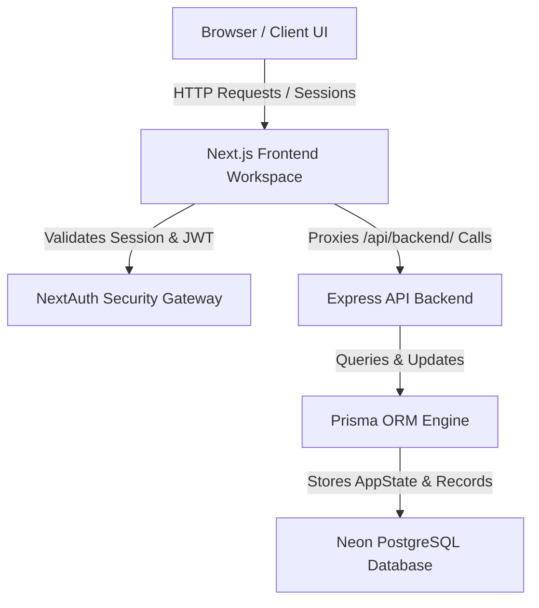

# System Architecture & Data Flow

This document details the system design, core pipelines, storage schemas, and operational data flows in the GenStack application.

## 1. System Architecture Flow

The following diagram illustrates the request lifecycle, routing path, and database integration:

---

## 2. AI Generator Pipeline Flow

The flowchart below traces how an initial natural language description is compiled, verified, and rendered as a fully functional dynamic application:

---

## 3. Data Flow & Workspace Isolation

Every request routed to the backend carries the NextAuth session token via secure HTTP-Only cookies. The authentication middleware decodes this token to extract the user's secure ID:

1. **Authentication Verification**:
   - `auth-middleware.ts` extracts `decoded.sub` from the JWT session cookie.
   - Attaches `request.userId` as the verified security principal.

2. **Scoped Database Isolation**:
   - Every database query for `AppState` or `GeneratedRecord` includes `userId` in the `where` criteria.
   - Prevents data leakage between different users.

3. **Synchronized Client-Side Cache**:
   - LocalStorage caches are prefixed with `${userId}` to isolate workspaces locally on shared browsers.
   - The frontend synchronizes this cache with PostgreSQL on startup and whenever modifications occur.
